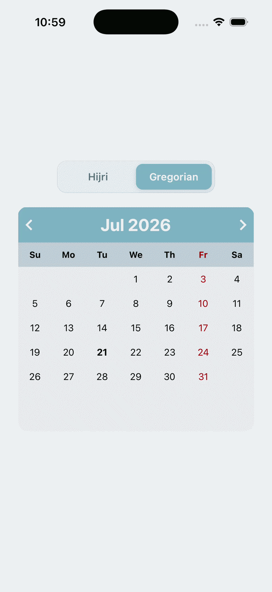

# react-native-hijiri-calendar

React Native calendar for **Hijri (Umm al-Qura)** and **Gregorian** dates. Supports month navigation, day selection, and date-range highlighting. Written in TypeScript.



## Installation

Requires React 18+, React Native 0.76+, and `@expo/vector-icons` (included with Expo).

```bash
pnpm add react-native-hijiri-calendar
npx expo install @expo/vector-icons
```

[Expo Snack example](https://snack.expo.io/@dev-ahmed/hcalender-example)

## Usage

```tsx
import React from 'react';
import {StyleSheet, View} from 'react-native';
import {HCalendar} from 'react-native-hijiri-calendar';

export default function App() {
  return (
    <View style={styles.container}>
      <HCalendar
        calendarType="hijiri"
        onDaySelect={(day, marked) => {
          console.log(day, marked);
        }}
        selectedDates={[
          {
            from: '1441/9/1',
            to: '1441/9/5',
            style: {borderColor: 'blue'},
          },
          {
            from: '1441/9/4',
            to: '1441/9/12',
            style: {borderColor: 'green'},
          },
        ]}
      />
    </View>
  );
}

const styles = StyleSheet.create({
  container: {
    flex: 1,
    alignSelf: 'center',
    justifyContent: 'center',
    alignItems: 'center',
  },
});
```

### Calendar types

| Value       | Description                        |
| ----------- | ---------------------------------- |
| `hijiri`    | Hijri / Islamic calendar (default) |
| `gregorian` | Gregorian calendar                 |

### Date formats

| Type      | Format used in `selectedDates` / `onDaySelect` |
| --------- | ---------------------------------------------- |
| Hijri     | `YYYY/M/D` (e.g. `1441/9/1`)                   |
| Gregorian | `YYYY/M/D` (e.g. `2020/4/15`)                  |

`onDaySelect` receives `(date, marked)` where `date` is a string in the format above, and `marked` is `true` if the day falls inside a `selectedDates` range.

For Hijri day taps, the returned string is `D/M/YYYY` (day-first). Prefer parsing with the same calendar type you configured.

## Props

| Prop                   | Type       | Default     | Description                                  |
| ---------------------- | ---------- | ----------- | -------------------------------------------- |
| `calendarType`         | `string`   | `'hijiri'`  | `'hijiri'` or `'gregorian'`                  |
| `selectedDates`        | `array`    | `undefined` | Ranges to highlight: `{ from, to, style }`   |
| `onDaySelect`          | `function` | —           | `(date, marked) => void`                     |
| `onPrev`               | `function` | —           | Called when navigating to the previous month |
| `onNext`               | `function` | —           | Called when navigating to the next month     |
| `iconPrev`             | `element`  | —           | Custom previous-month icon                   |
| `iconNext`             | `element`  | —           | Custom next-month icon                       |
| `customHMonths`        | `array`    | short names | Override Hijri month labels (12 strings)     |
| `customGMonths`        | `array`    | short names | Override Gregorian month labels (12 strings) |
| `customWeekDays`       | `array`    | locale min  | Override weekday labels (7 strings)          |
| `containerStyle`       | `style`    | `{}`        | Outer calendar container                     |
| `headerStyle`          | `style`    | `{}`        | Header bar                                   |
| `headerFontStyle`      | `style`    | `{}`        | Header month/year text                       |
| `fontStyle`            | `style`    | `{}`        | Day number text                              |
| `weekDaysStyle`        | `style`    | `{}`        | Weekday row                                  |
| `dayNameFontStyle`     | `style`    | `{}`        | Weekday label text                           |
| `currentDayStyle`      | `style`    | `{}`        | Today’s day text                             |
| `markedDatesTextStyle` | `style`    | `{}`        | Text style for days inside a marked range    |
| `dayContainerStyle`    | `style`    | `{}`        | Individual day cell                          |
| `colContainerStyle`    | `style`    | `{}`        | Row / column container                       |

### `selectedDates` item shape

```javascript
{
  from: '1441/9/1',   // start date (inclusive)
  to: '1441/9/5',     // end date (inclusive)
  style: {            // applied to the highlight bar
    borderColor: 'blue',
  },
}
```

## Contributing

Pull requests are welcome.
